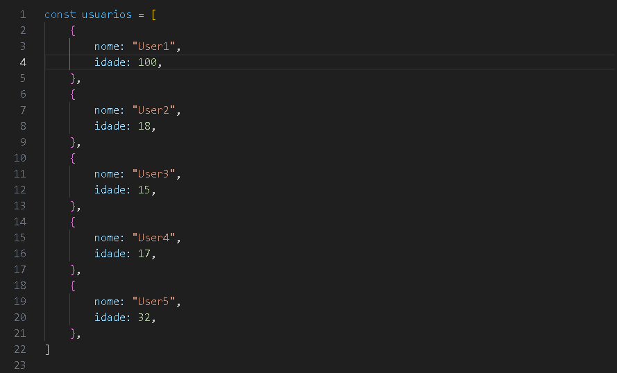
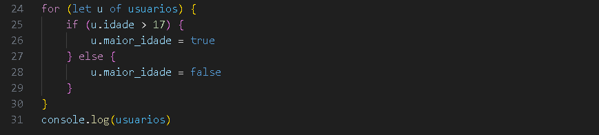
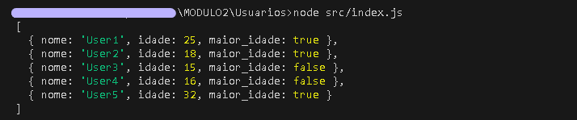

# Usuarios

## 📌 Sobre o projeto
Fiz este projeto na [Cubos Academy](https://cubos.academy/) pelo curso de [Desenvolvimento de Software](https://cubos.academy/cursos/desenvolvimento-de-software) através de uma [bolsa do Ifood](https://cubos.academy/lp/1000bolsasifood).

Este código manda uma lista com os nomes e idades dos usuários e já verifica se a pessoa é **maior de idade** ou não, retornando *true* para verdadeiro e *false* para falso.

Neste projeto existem dois passos, 
#### 1 passo: é um objeto com os usuários e suas respectivas idades:

#### 2 passo: é um loop que verifica a idade, se for maior que 17 retorna um true, se não, retorna false.

## 🤔 Como executar o código
Para conseguir executar o código você precisa:
- ter o Node.js instalado;
- abrir o terminal e rodar com node o arquivo index.js.

O retorno esperado é: 

# 😄 Obrigada!

Obrigada por ler meu código, estou no início da minha jornada na programação, se quiser entrar em contato comigo, no [meu perfil](https://github.com/SaraBahck) tem meu Linkedin e Instagram onde você pode entrar em contato comigo! :D

